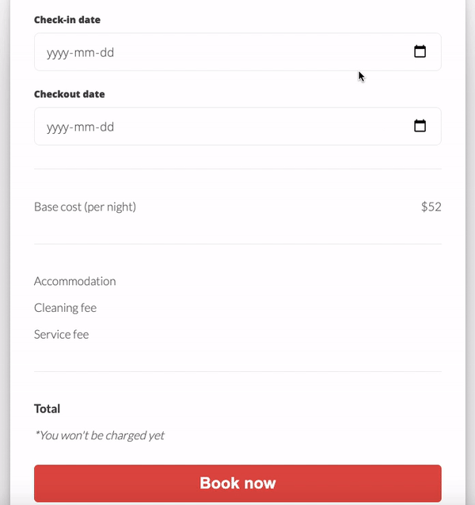
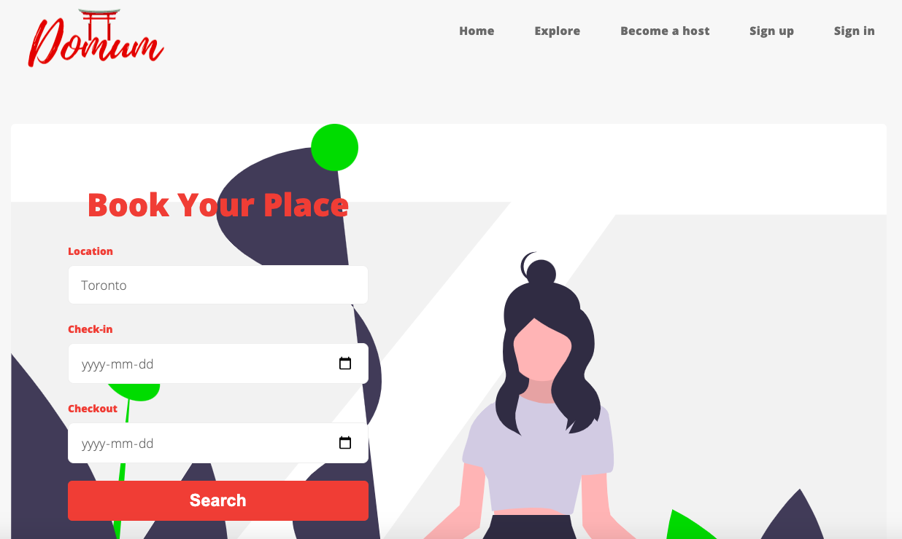
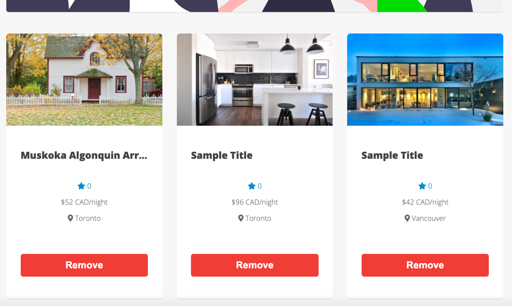
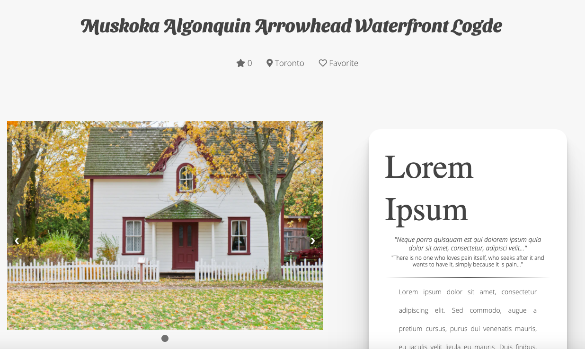

    
    <h2>Vacation Rental Online Marketplace</h2>

    

## About

This is an AirBnB clone built for educational purposes. Check out the deployed version at https://oliver-pham-domum.herokuapp.com/.  
It is built with:
- Backend: [Node](https://nodejs.org/en/), [Express](https://expressjs.com)
- Template engine: [Handlebars](https://handlebarsjs.com)
- DBMS: [MongoDB](https://www.mongodb.com)
- Frontend: HTML, CSS, [jQuery](https://jquery.com)
- Testing frameworks: [Mocha](https://mochajs.org), [Chai](https://www.chaijs.com).

    
     
    
    
    

## Features

- User Authentication & Authorization
- Upload/Edit/Remove a listing
- Upload/Remove any images of a listing 
- Search for particular listings by location
- Book a room and see the details of the booking
- Get email notification for every booking

## Contributing

Pull requests are welcome. For major changes, please open an issue first to discuss what you would like to change.

Please make sure to update tests as appropriate.

## License

Distributed under the [MIT License](https://choosealicense.com/licenses/mit/).